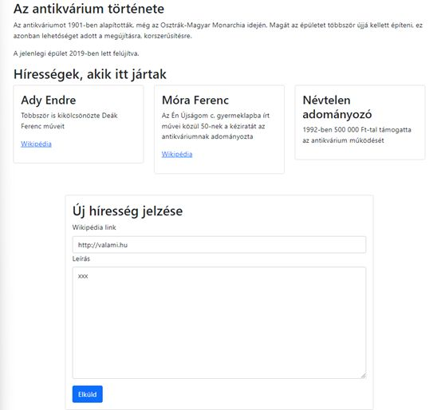

# Vizsga gyakorlás

## Előkészületek

* Készítsen egy forkot erről a repositoryról!
* A másolatot klónozza le a saját számítógépére!
* Ebben a másolatban dolgozzon, és a módosításokat töltse fel a GitHub-ra!
* A végén a GitHub repository címét adja be!

## 1. feladat

Jelenítse meg a *feladat1-tartalom.txt* fájlban kapott szöveget az alkalmazásban úgy, hogy a tesztek lefussanak!

A fejlécben a cím a logó mellett legyen, és függőlegesen a középvonaluk legyen egy vonalban!

A teljes szöveg talpatlan betűkkel jelenjen meg, a teljes szélesség 80%-át foglalja el, és vízszintesen középre legyen igazítva!

A láblécben helyezze el a „Készítette:” szöveget és utána írja be a saját nevét! A lábléc szövege legyen középre igazítva, és fölötte legyen 2 alapértelmezett betűméretnyi margó!

## 2. feladat

Jelenítse meg a *feladat2-tartalom.txt* fájlban kapott szöveget az alkalmazásban úgy, hogy a tesztek lefussanak!

Közepes és nagyobb képernyőn a hírességek egymás mellett, kisebb képernyőn a egymás alatt jelenjenek meg!

Az alsó rész, ahol az adatokat lehet bevinni, a teljes szélesség 75%-át foglalja el, és vízszintesen középre legyen igazítva! A link mezőben csak hivatkozást fogadjon el!
Az adatokat kontrollált mezőkben lehessen beírni! A mezők adatait egy objektumban tárolja, és a módosításokat egy közös függvény kezelje!

Az Elküld gomb megnyomásakor írja ki az adatokat a konzolra!

## 3. feladat

Készítsen Single Page Application-t, amely három oldalból áll. Az egyes oldalak címét és tartalmát a *feladat3-tartalom.txt* fájl tartalmazza. Minden oldalról lehessen a másik kettőre navigálni!

Az alkalmazást úgy készítse el, hogy a tesztek lefussanak!

Az oldalakat a Bootstrap használatával formázza! Minden oldal tetején jelenjen meg a navigáció sötét háttérrel! Alatta az oldal tartalma egy konténerben legyen!

A sci-fi oldalon a könyvek egy felsorolásban jelenjenek meg!

A hunor oldalon a szerzők és a címek egy táblázatba kerüljenek!

## 4. feladat

Készítsen egy Konyvajanlo nevű komponenst, amely egy könyv címét és árát jeleníti meg! Az App komponens hívja meg ezt tesztadatokkal! Az alkalmazást úgy készítse el, hogy a tesztek lefussanak!

Az oldalakat SCSS-sel, a kapott *_colors.scss* fájlban lévő színeket felhasználva formázza! 
Az oldal háttérszíne legyen a *hatter* nevű szín! Az ajánlat egy szaggatott vonalú, 50%-os szélességű keretben, 1 betűméretnyi belső- és külső margóval jelenjen meg!

Ha akciós a könyv, akkor az ára a kiemeles nevű színnel jelenjen meg!

## 5. feladat

Készítsen egy *Konyv* nevű osztályt, amelynek objektum létrehozáskor egy könyv címét és ISBN számát kell megadni.

Ha a cím üres vagy az ISBN szám nem 10 számjegy karakterből áll, akkor a konstruktor dobjon hibát!

Egészítse ki az App komponenst úgy, hogy meg lehessen adni egy könyv címét és ISBN számát!

Legyen egy gomb, amelyre rákattintva megpróbál létrehozni egy új példányt a Konyv osztályból!
Hiba esetén írjon ki egy hibaüzenetet!

Ha sikerül létrehozni az új példányt, akkor írja ki a konzolra a címét és az ISBN számát, majd törölje a beviteli mezőket, és a korábbi hibaüzenetet (ha van)!

## 6. feladat

Indítson el a json-server segítségével egy olyan API-t a számítógépén, amely <http://localhost:4000/konyvek> címre küldött GET kérésre a feladat6-adatok.json fájlban lévő adatokat adja vissza!

Készítsen egy olyan alkalmazást, amely induláskor lekéri ezeket az adatokat és megjeleníti egy táblázatban! A táblázatot Bootstrap segítségével úgy formázza meg, hogy a páros sorok háttere szürke, a páratlanoké fehér legyen!

Amíg az adatok letöltődnek, a feladat6-loading.gif kép legyen látható! A kép szélessége 100 képpont legyen! Az alkalmazás tetején 25 képpontnyi belső margó legyen!

Az App.test.js fájlban lévő teszteknek sikeresen le kell futniuk.
